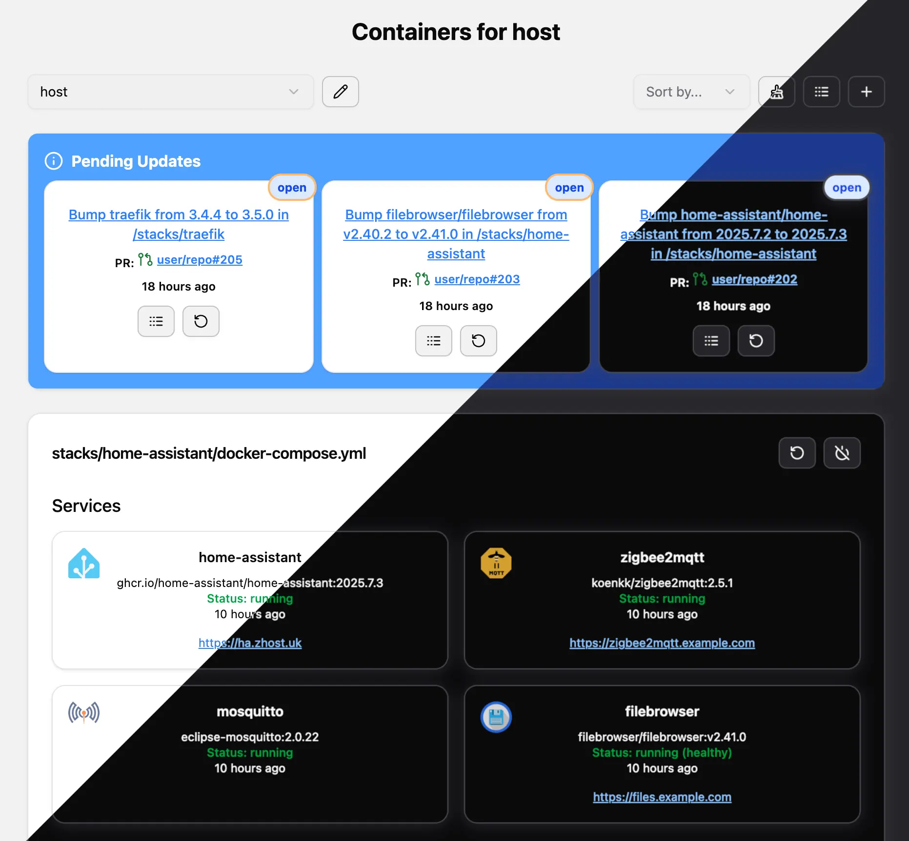

# Containers Up!

[](https://github.com/DigitallyRefined/containers-up/actions/workflows/build-and-push.yml)
[](https://github.com/DigitallyRefined/containers-up/pkgs/container/containers-up)
[](https://github.com/DigitallyRefined/containers-up/pkgs/container/containers-up)

Containers Up! is a web-based container management platform designed to simplify the administration of containers across multiple remote hosts.

It provides a unified interface for managing containerized applications, and automating updates with minimal manual intervention.

## Key Features

- 🖥️ **Multi-Host Management**: Manage containers on multiple hosts via SSH connections
- 🎛️ **Granular Control**: 
  - 📦 Control stacks/services via compose files
  - 🐳 Manage individual containers
  - 🖼️ Container image management
  - 🗑️ Cleanup of unused images
- 🔄 **Automated Updates**: Container updates via GitHub webhooks (via Dependabot pull requests) & image tag updates via a schedule
- 📩 **Notifications**: When a new Dependabot PR is created or a new container image is available (via [Apprise](https://github.com/caronc/apprise#supported-notifications))
- 🌐 **Service Discovery**: Display web app icons and URLs (via existing Traefik labels)
- 🧹 **Resource Management**: Cleanup of older images
- 🏷️ **Tag Lookup**: Updates for images using SHA hashes can be reverse looked up to find their associated tags
- 📱 **Responsive Design**: Works seamlessly on desktop and mobile devices
- 🌓 **Modern UX**: Automatic light and dark mode (based on system settings)
- 📊 **Job Tracking**: Monitor update jobs with detailed logs and retry capabilities
- 🔐 **Security**: Secure SSH connections and webhook signature verification

## Screenshot



## Installation

The app can be started using the following `compose.yml`:

```yaml
services:
  containers-up:
    # https://github.com/DigitallyRefined/containers-up/releases
    image: ghcr.io/digitallyrefined/containers-up:0.0.17
    restart: always
    ports:
      - 3000:3000
      - 3001:3001
    volumes:
      - ./storage:/storage
      - ./storage/.ssh:/root/.ssh
      - ./storage/.docker:/root/.docker
```

Open `http://localhost:3000` to set up a new host. Set a name, SSH host and private key to display a dashboard of running composed containers, individual containers, images and actions.

Optional system wide configuration can be changed by copying `.env.default` to `.env` and adding `env_file: ./.env` to the compose file.

<details>
<summary>compose.yml example with HTTPS & authentication (via Pocket ID & Traefik)</summary>

1. See [Simple HTTPS Traefik Tutorial](https://www.youtube.com/watch?v=-hfejNXqOzA) and [Pocket ID walkthrough](https://www.youtube.com/watch?v=GKyMXguNcos)

```yaml
services:
  containers-up:
    # https://github.com/DigitallyRefined/containers-up/releases
    image: ghcr.io/digitallyrefined/containers-up:0.0.17
    restart: always
    volumes:
      - ./containers-up/storage:/storage
      - ./containers-up/storage/.ssh:/root/.ssh
      - ./containers-up/storage/.docker:/root/.docker
    env_file:
      - ./.env # < Create this file based on the .env.default instructions
    networks:
      - traefik
    labels:
      traefik.enable: true

      traefik.http.routers.containers-up.entrypoints: websecure
      traefik.http.routers.containers-up.rule: Host(`containers-up.example.com`) # < Update this
      traefik.http.routers.containers-up.tls: true
      traefik.http.routers.containers-up.tls.certresolver: production-cloudflare-dns
      traefik.http.routers.containers-up.service: containers-up
      traefik.http.services.containers-up.loadbalancer.server.port: 3000
      traefik.http.middlewares.containers-up-headers.headers.customrequestheaders.X-Proxy-Key: ${API_PROXY_KEY}
      traefik.http.routers.containers-up.middlewares: oidc-auth-admin-only@file,containers-up-headers@docker

      traefik.http.routers.containers-up-webhook.entrypoints: websecure
      traefik.http.routers.containers-up-webhook.rule: Host(`containers-up.example.com`) && PathPrefix(`/api/webhook`) # < Update this
      traefik.http.routers.containers-up-webhook.tls: true
      traefik.http.routers.containers-up-webhook.tls.certresolver: production-cloudflare-dns
      traefik.http.routers.containers-up-webhook.service: containers-up-webhook
      traefik.http.services.containers-up-webhook.loadbalancer.server.port: 3001

  pocket-id:
    # https://github.com/pocket-id/pocket-id/releases
    image: ghcr.io/pocket-id/pocket-id:v1.6.4
    restart: always
    volumes:
      - './pocket-id/data:/app/data'
    environment:
      - APP_URL=https://id.example.com # < Update this
      - TRUST_PROXY=true
    networks:
      - 'traefik'
    labels:
      traefik.enable: true
      traefik.http.routers.pocketid.entrypoints: websecure
      traefik.http.routers.pocketid.rule: Host(`id.example.com`) # < Update this
      traefik.http.routers.pocketid.tls: true
      traefik.http.routers.pocketid.tls.certresolver: production-cloudflare-dns

  traefik:
    # Check migration guide first: https://doc.traefik.io/traefik/master/migration/v3/
    # https://github.com/traefik/traefik/releases
    image: docker.io/traefik:3.5.0
    container_name: 'traefik'
    restart: unless-stopped
    ports:
      - '80:80'
      - '443:443' # To setup HTTPS see: https://www.youtube.com/watch?v=-hfejNXqOzA
    volumes:
      - ./traefik/config:/etc/traefik
      - /var/run/docker.sock:/var/run/docker.sock:ro
    networks:
      - 'traefik'

networks:
  traefik:
    external: true
```

2. Create the network `docker network create traefik` and start the services `docker compose up -d`
3. Once Traefik and Pocket ID are up and running, set up a new user via Pocket ID and add it to an admin group.
4. Create a new OIDC client and set up the callback URL as `https://containers-up.example.com/oidc/callback` and copy the ID and secret into the file below

`traefik/config/oidc-auth-admin-only.yml`
```yaml
http:
  middlewares:
    oidc-auth-admin-only:
      plugin:
        traefik-oidc-auth:
          Secret: "<create a random a-z-A-Z-0-9 secret>"
          Provider:
            Url: "https://id.example.com/"
            ClientId: "<copy the ClientId from the provider>"
            ClientSecret: "<copy the ClientSecret from the provider>"
            TokenValidation: "IdToken"
          Scopes: ["openid", "profile", "email", "groups"]
          Authorization:
            AssertClaims:
              - Name: groups
                AnyOf: ["admin"]
```

5. Accessing `https://containers-up.example.com` should now require you to login
</details>

## Setting up automatic `compose.yml` updates via Dependabot

1. Make sure that your Containers Up! instance is available online publicly via HTTPS,  sharing only the webhook port `3001`. E.g. via a [Cloudflare Tunnel](https://developers.cloudflare.com/cloudflare-one/connections/connect-networks/) or a [Docker Wireguard Tunnel](https://github.com/DigitallyRefined/docker-wireguard-tunnel)

2. Create a GitHub repository with your container `compose.yml` files

3. Each of your `compose.yml` files must use the full image version (**not** `:latest`) to receive Dependabot updates

4. Under the **Settings > Actions**, enable **Allow all actions and reusable workflows** and under **Workflow permissions** allow **Read and write permissions**

5. In your repo add `.github/dependabot.template.yml`:

```yaml
version: 2
enable-beta-ecosystems: true # Remove once docker-compose updates become stable
updates:
  - package-ecosystem: "docker-compose"
    directory: "**/compose.yml" # change this based on if you call your files compose.yml or docker-compose.yml

  - package-ecosystem: "github-actions"
    directory: "/"
```

6. Create a `.github/workflows/generate_dependabot.yml` file with the following content:

```yaml
name: Generate dependabot.yml

on:
  push:
    branches:
      - main
  repository_dispatch:
  workflow_dispatch:

jobs:
  generate:
    runs-on: ubuntu-latest
    steps:
      
      - uses: actions/checkout@v5
        
      - name: Generate dependabot.yml
        uses: Makeshift/generate-dependabot-glob-action@master

      - name: Create Pull Request
        uses: peter-evans/create-pull-request@v7
```

7. This will automatically create a PR that will create a GitHub action managed `.github/dependabot.yml` file, which will automatically be updated for each of your `compose.yml` files. If it doesn't, click **Actions > Generate dependabot.yml > Run workflow**

8. Next edit your host in Containers Up! and add the working folder where your repo is checked out on your server and add your GitHub repo URL `user/repo` (without `https://github.com/`), generate a random webhook secret and click the ℹ️ info icon copy the base URL to the webhook

9. Back on GitHub, go to **Settings > Webhooks > Add webhook**, add your public webhook domain and base URL (listed on the Containers Up! edit webhook info screen). Use the same random webhook secret from your repo settings, choose **Let me select individual events > Pull requests** 

If everything has been set up correctly the next time Dependabot creates a PR to update a `compose.yml` file an update will also appear on the Containers Up! dashboard.
